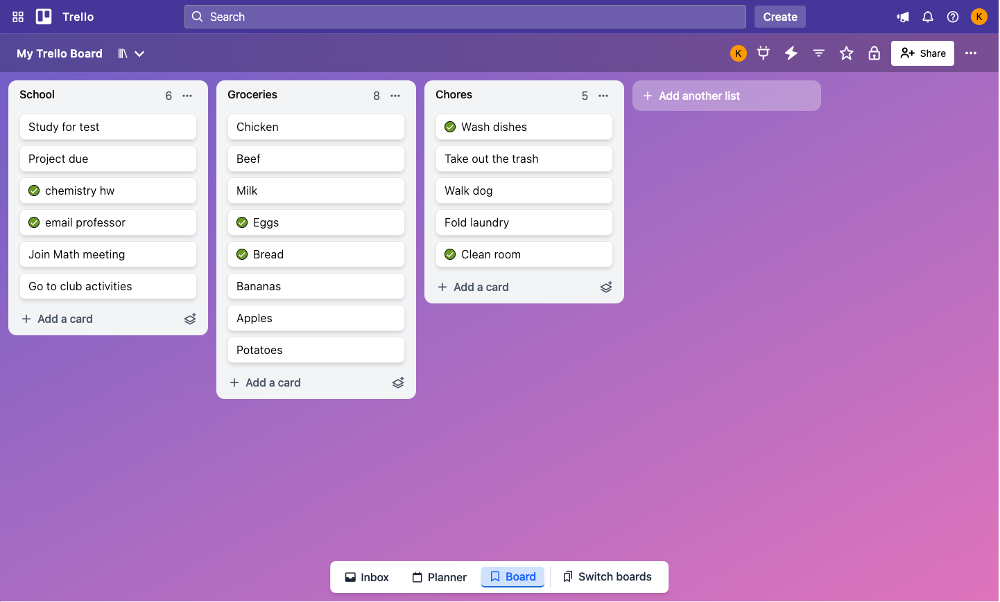
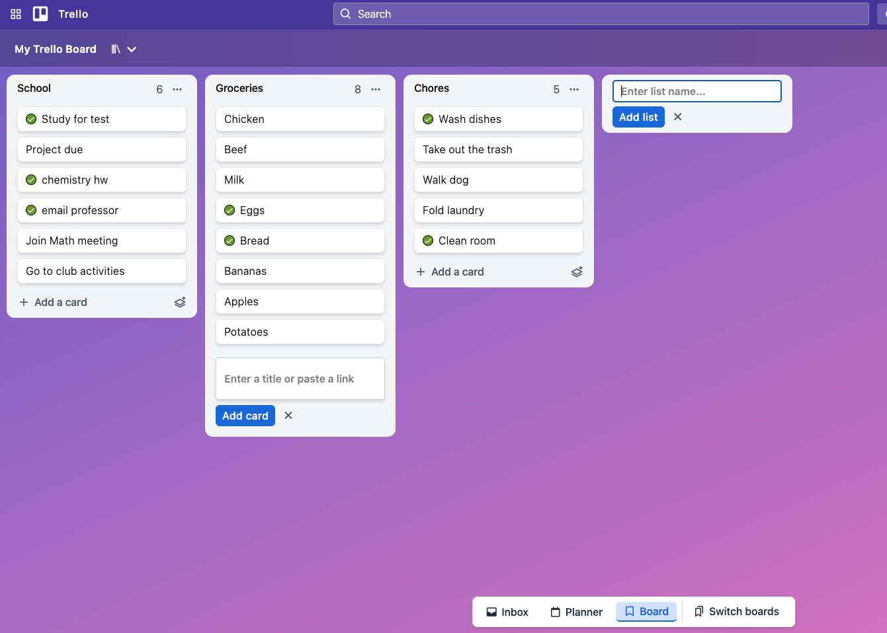
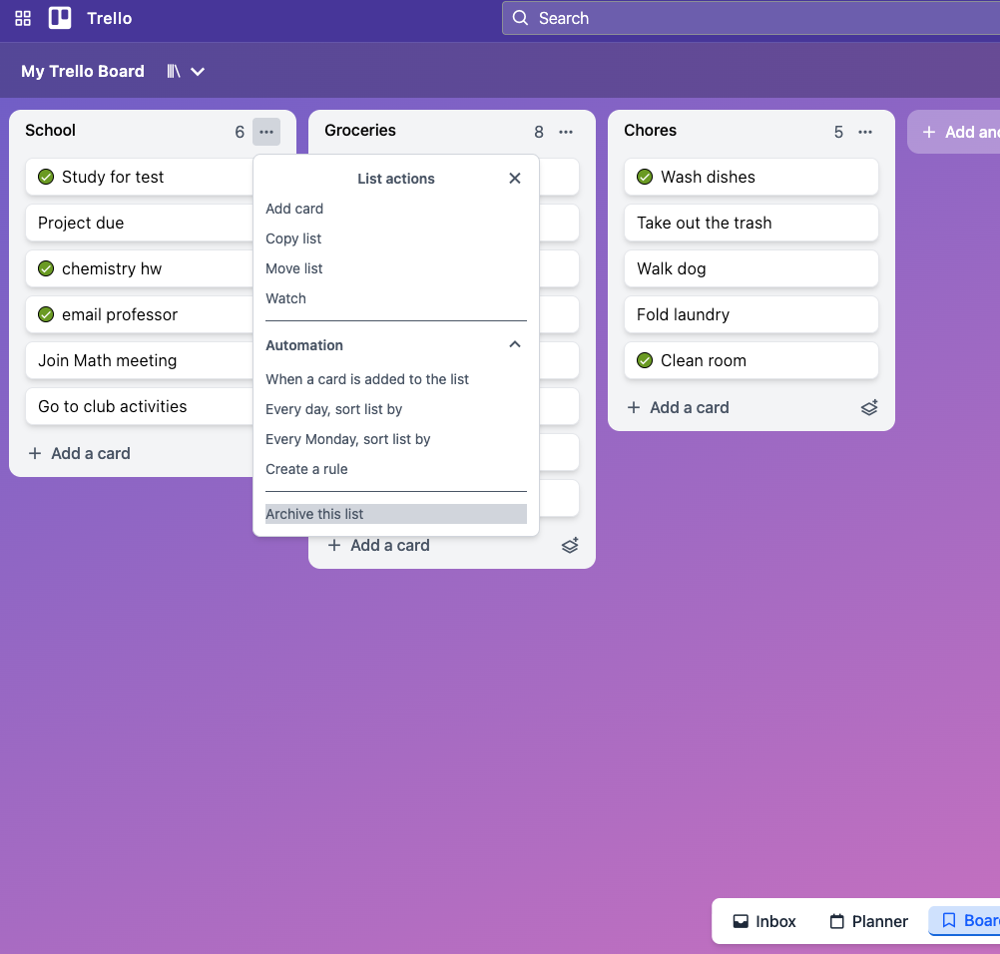
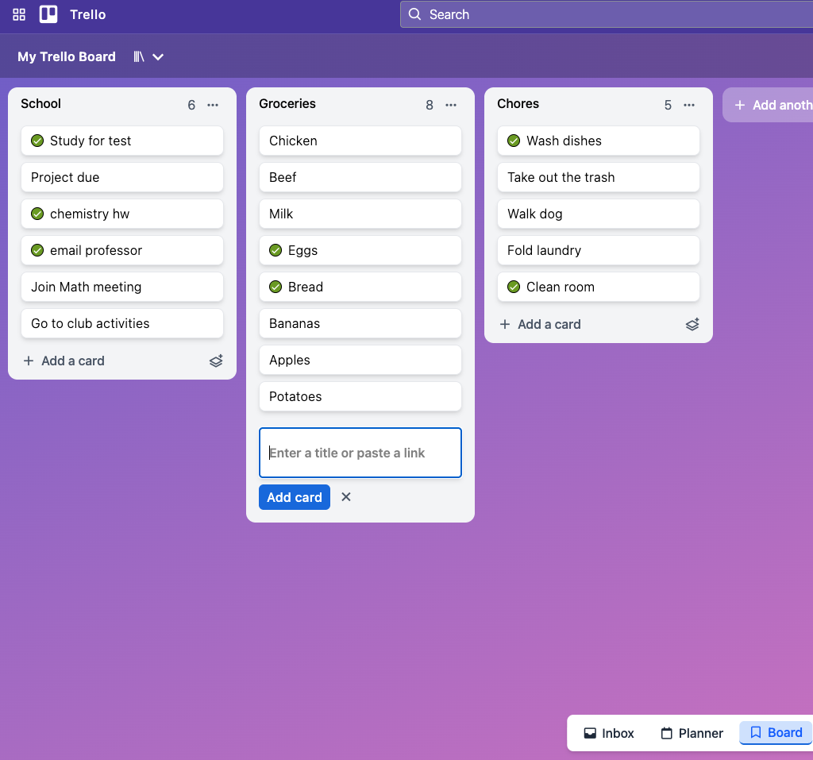
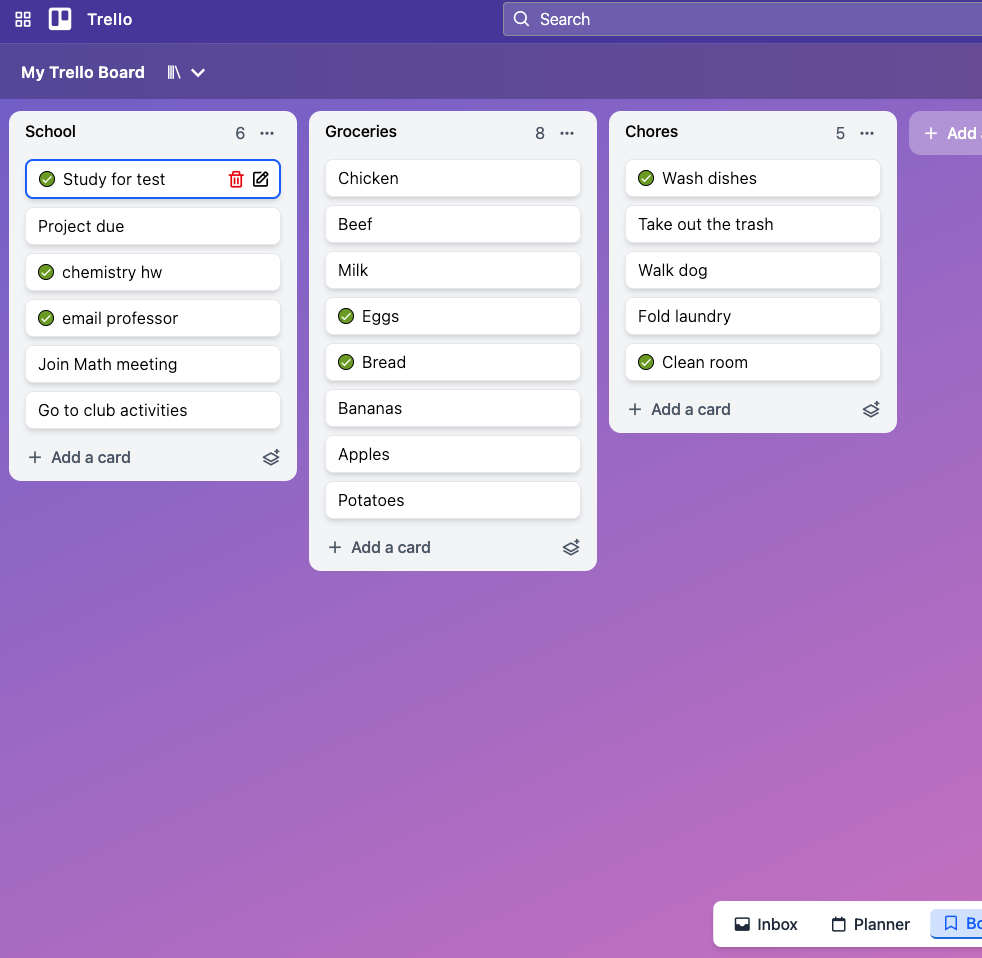
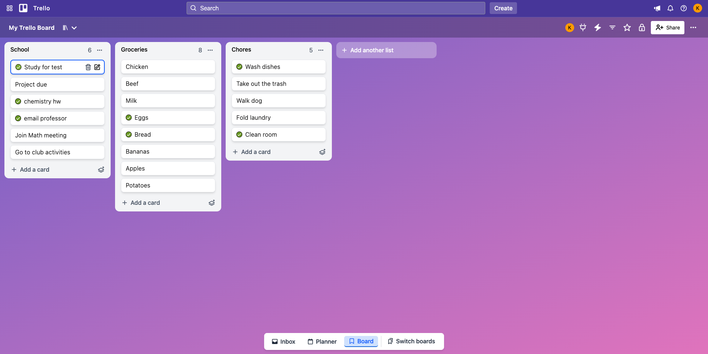
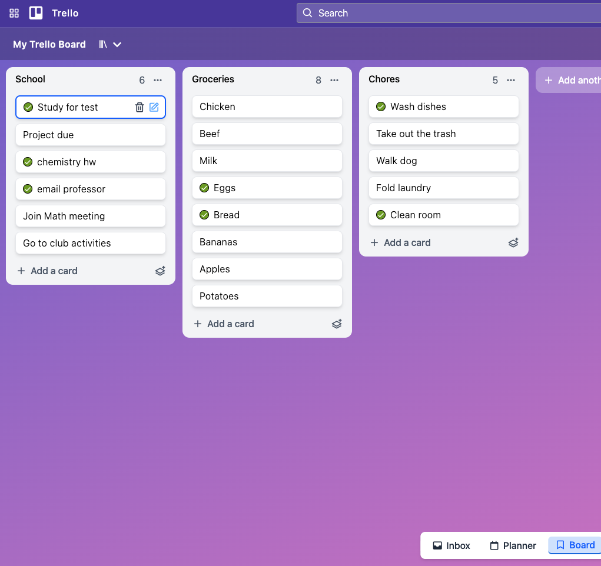
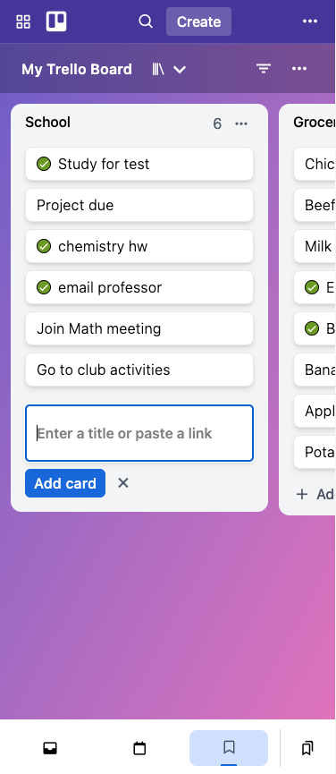

# Kanban Board

A full-stack Kanban board application inspired by Trello that allows users to create lists, manage tasks, update task status, and organize work through a simple task management interface. The application uses a React frontend, Express REST API, MongoDB database, and separate frontend and backend deployments.

## Live Demo

Frontend:
https://kanban-board-dusky-six.vercel.app/

Backend:
https://kanban-board-api-kx63.onrender.com

(The backend URL provides REST API endpoints used by the frontend.)

## Screenshots

### Board



### List Management




### Task Management





### Editing Tasks



### Mobile



## Features

* Create and delete lists
* Add tasks to lists
* Edit existing tasks
* Delete tasks
* Toggle task completion status
* Persistent data storage with MongoDB
* Responsive user interface

## Tech Stack

### Frontend

* React
* TypeScript
* Tailwind CSS
* Vite

### Backend

* Node.js
* Express
* TypeScript
* MongoDB
* Mongoose

### Deployment

* MongoDB Atlas
* Vercel
* Render

## Project Structure

```text
bulletin-board/
├── frontend/
├── backend/
├── screenshots/
└── README.md
```

## Installation

### Clone Repository

```bash
git clone https://github.com/loganyeh/kanban-board.git
```

### Frontend

```bash
cd frontend

npm install

npm run dev
```

### Backend

```bash
cd backend

npm install

npm run dev
```

## Environment Variables

### Frontend (.env)

```env
VITE_API_URL=http://localhost:3000
```

### Backend (.env)

```env
MONGO_URI=your_mongodb_connection_string
```

## Key Implementation

* Built reusable React components for lists, tasks, headers, and forms
* Created a frontend service layer to handle API communication
* Built a REST API using Express for list and task management
* Implemented CRUD operations for lists and tasks
* Created nested routes for managing tasks within specific lists
* Built Express controllers and routes for handling application logic
* Created MongoDB schemas and models using Mongoose
* Used TypeScript to improve type safety across frontend and backend
* Configured environment variables for local development and production deployment
* Deployed frontend with Vercel and backend with Render

## API Features

* Retrieve all lists
* Create new lists
* Delete lists
* Add tasks to lists
* Update task content
* Toggle task completion status
* Delete tasks

## Future Improvements

* Add user authentication
* Add user accounts and personal boards
* Add drag-and-drop functionality
* Add board sharing and collaboration
* Improve validation and error handling
* Add better loading and error states

## License

This project is for educational and portfolio purposes.